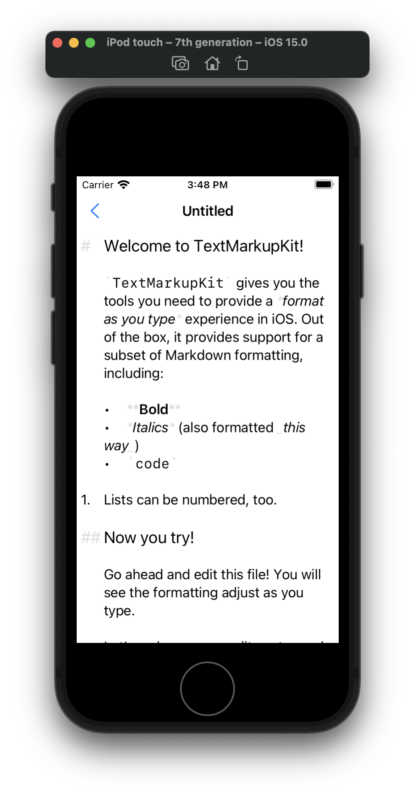

# TextMarkupKit

Many iOS applications give you the ability to write plain text in a `UITextView` and format that text based upon simple rules. TextMarkupKit makes it easy to add "format as you type" capabilities to any iOS application. 


It consists of several interrelated components:

1. One set of components let you write a [Parsing Expression Grammar](https://en.wikipedia.org/wiki/Parsing_expression_grammar) to define how to parse the user's input. Because writing grammars is hard, TextMarkupKit lets you design "extensible grammars." Extensible grammars have explicit extension points where people can introduce new rules rather than writing an entire language grammar from scratch. `TextMarkupKit` also provides an extensible grammar for a subset of Markdown syntax called `MiniMarkdownGrammar`. You can extend `MiniMarkdownGrammar` by providing additional parsing rules for block or inline styles.
2. An implementation of Dubroy & Warth's [Incremental Packrat Parsing](https://ohmlang.github.io/pubs/sle2017/incremental-packrat-parsing.pdf) algorithm to efficiently re-parse text content as the user types in the `UITextView`.
3. A system to format an `NSAttributedString` based upon the parse tree for its `-string` contents. TextMarkupKit's formatting support was designed around the needs of lightweight "human markup languages" like Markdown instead of syntax highlighting of programming languages. In addition to changing the attributes associated with text, TextMarkupKit's formatting rules let you transform the displayed text itself. For example, you may choose to change a space to a tab when formatting a list, or not show the special formatting delimiters in some modes, or replace an image markup sequence with an actual image attachment. TextMarkupKit supports all of these modes.
4. A way to efficiently integrate the formatted `NSAttributedString` with TextKit so it can be used with a `UITextView`.

TextMarkupKit provides the parsing / formatting support for my application [Grail Diary](https://bdewey.com/projects/grail-diary).

## Installation

Install `TextMarkupKit` using Swift Package Manager. 

```
  dependencies: [
    .package(url: "https://github.com/bdewey/TextMarkupKit", from: "0.7.0"),
  ],

```

Please note that TextMarkupKit is not yet at Version 1.0.0 -- the API is changing frequently and dramatically as I adopt code written for one specific application for general use.

## Using TextMarkupKit -- the absolute basics

While `TextMarkupKit` is designed to support custom formatting and custom markup languages, you can get started with a subset of Markdown out-of-the box. Using UIKit:

```swift
import TextMarkupKit
import UIKit

// textStorage will hold the characters and formatting (determined by the markup rules).
//
// MiniMarkdownGrammar.defaultEditingStyle():
// - Tells `ParsedAttributedString` to use the rules of MiniMarkdownGrammar to parse the text
// - Provides a default set of formatters to style the parsed text.
let textStorage = ParsedAttributedString(string: "# Hello, world!\n", style: MiniMarkdownGrammar.defaultEditingStyle())

// MarkupFormattingTextView is a subclass of UITextView and you can use it anywhere you would use a UITextView.
let textView = MarkupFormattingTextView(parsedAttributedString: textStorage)
```

Using SwiftUI:

```swift
import SwiftUI
import TextMarkupKit

struct ContentView: View {
  @Binding var document: TextMarkupKitSampleDocument

  var body: some View {
    // `MarkupFormattedTextEditor` is a SwiftUI wrapper around `MarkupFormattingTextView` that commits its changes back to the
    // text binding when editing is complete. By default it uses `MiniMarkdownGrammar.defaultEditingStyle()`, but you can provide
    // a custom style with the `style:` parameter.
    MarkupFormattedTextEditor(text: $document.text)
  }
}
```

That's it! You now have a view that will format plain text and automatically adjust as the content changes. Check out the [sample application](TextMarkupKitSample) to see this in action.



## Further Reading

Since this project started for personal use, documentation is sparse. While I build it up, this is an overview of the important areas of code.

### Parsing

- `ParsingRule` is an abstract base class. The job of a parsing rule is to evaluate the input text at specific offset and produce a `ParsingResult`, which is a struct that indicates:
    - If the parsing rule succeeded at that location
    - If the rule succeeded, how much of the input string is *consumed* by the rule. Parsing continues after the consumed input.
    - How much of the input string the `ParsingRule` had to look at at to make its success/fail decision.
- `PackratGrammar` is a protocol something that defines a complete grammar through a graph of `ParsingRule`s. `PackratGrammar` exposes a single rule, `start`, that will be used when attempting to parse a string.
- `MemoizationTable` implements the core incremental packrat parsing algorithm. 
    
Additionally, `ParsingRule.swift` defines many simple rules that you can combine to build much more complex rules for constructing your grammar.

- `DotRule` matches any character.
- `Characters` matches any character defined by a `CharacterSet`.
- `Literal` matches a string literal.
- `InOrder` takes an array of child rules and succeeds if **every** one of the child rules succeeds in sequence.
- `Choice` also takes an array of child rules, but matches the **first** of the child rules in the array.
- `AssertionRule` takes a single child rule. It succeeds if its child rule succeeds **but** it does not consume the input.
- `NotAssertionRule`, like `AssertionRule`, takes a single child rule. It will succeed if its child rule fails and vice versa, and never consumes input.
- `RangeRule` takes a single child rule and will try repeatedly match the rule to the input. It succeeds if the number of successful repetitions of the child rule falls within a specified range.

### TextStorage

- `PieceTable` implements the [piece table](https://darrenburns.net/posts/piece-table/) data structure for efficient text editing.
- `PieceTableString` is a subclass of `NSMutableString` that uses a `PieceTable` for its internal storage.
- `ParsedAttributedString` is a subclass of `NSMutableAttributedString` that:
    1. Uses a `PieceTableString` for character storage;
    2. Uses a `MemoizationTable` to parse the string *and* incrementally re-parse the string on each change;
    3. Applies a set of formatting rules based upon the parsed syntax tree to determine the formatting of the string. 
- `ObjectiveCTextStorageWrapper` is an `NSTextStorage` implementation that lets you use a `ParsedAttributedString` as the backing storage for `TextKit`, like `UITextView`.
